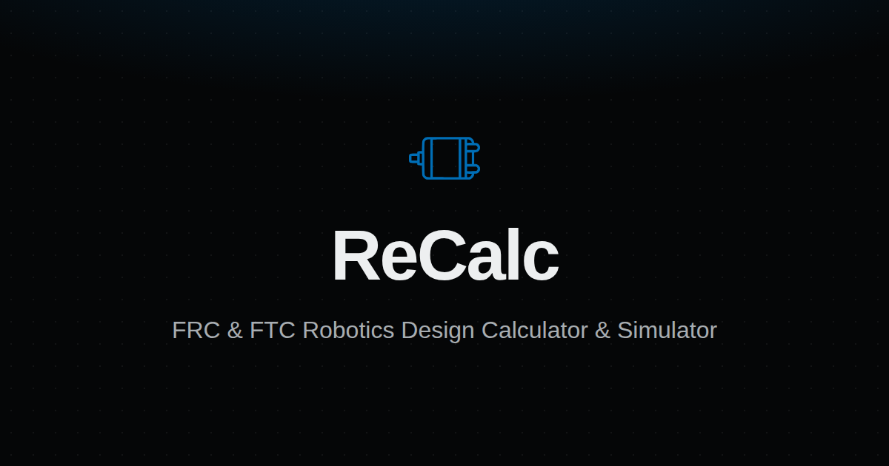

# ReCalc



A design calculator website for FIRST Robotics Competition (FRC) and FIRST Tech Challenge (FTC).

## Quick Start

Install [mise](https://mise.jdx.dev/) to manage Node.js, pnpm, and other tools automatically.

```sh
mise install   # installs Node.js, pnpm, jq, clang-format from mise.toml
pnpm install
pnpm run dev
```

The mise `enter` hook runs `pnpm install --frozen-lockfile` automatically whenever you `cd` into the project.

## Commands

### Mise tasks (orchestrate multiple steps)

- `mise run check` - Typecheck, format check, and lint in parallel
- `mise run format` - Format web (oxfmt) and C++ source simultaneously
- `mise run test:e2e` - Build app then run Playwright tests (handles build prerequisite automatically)

### pnpm scripts

- `pnpm run dev` - Start development server
- `pnpm run build` - Build for production
- `pnpm run build:wpi` - Build WASM bindings from wpilib (requires Docker)
- `pnpm run start` - Preview production build
- `pnpm run lint` - Run linter
- `pnpm run lint:fix` - Fix linting issues
- `pnpm run format:fix` - Fix web formatting (oxfmt)
- `pnpm run format:wpi` - Fix C++ formatting (clang-format via mise)
- `pnpm run typecheck` - Type check TypeScript

## Testing

- `pnpm run test` - Run unit tests (Vitest)
- `pnpm run test -u` - Update snapshot tests (use when snapshot output changes)
- `mise run test:e2e` - Run Playwright UI tests (builds first automatically)
- `pnpm exec playwright test` - Run Playwright UI tests (requires build first: `pnpm run build`)

## Tech Stack

- React Router v7 (framework mode)
- TypeScript
- Shadcn UI + Tailwind CSS
- Comlink (for background workers)
- Vitest + Playwright (testing)
- Icons: https://icon-sets.iconify.design/
